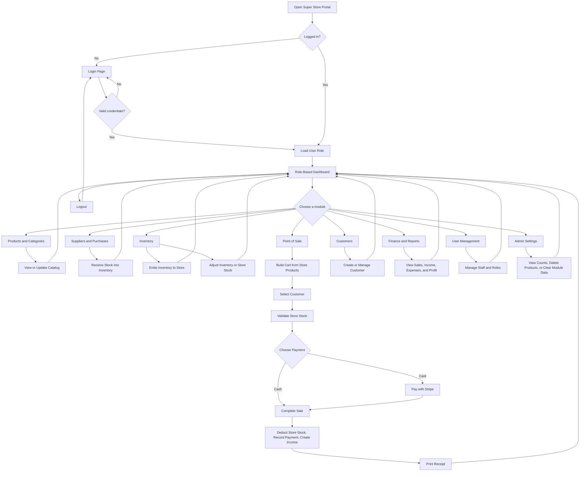

# Super Store Portal: Simple Site Flow

This is the short, user-friendly flow of the Super Store Portal.

## Main Site Flow



## Role-Based Start Pages

After login, the user sees only the modules allowed for their role:

| Role | Main Starting Area |
| --- | --- |
| Admin | Full dashboard and all modules |
| Store Manager | Operational dashboard |
| Inventory Manager | Inventory dashboard |
| Cashier | Cashier dashboard and POS |
| Accounts/Finance | Financial dashboard |

## Common User Flows

### Login

`Open site -> Login -> Verify credentials -> Load role -> Show dashboard`

### Add a Product

`Products -> Add product -> Select category and supplier -> Upload image -> Save -> Product appears in catalog`

### Receive a Purchase

`Purchases -> Select supplier -> Add products -> Save purchase -> Increase inventoryQuantity -> Record INVENTORY movement -> Update supplier balance`

### Adjust Inventory

`Inventory -> Select product -> Enlist quantity to store -> Decrease inventoryQuantity -> Increase storeQuantity -> Record TRANSFER movements`

### Complete a Sale

`POS -> Load store products -> Add products to cart -> Select customer -> Validate storeQuantity -> Choose cash or card -> Complete sale -> Deduct storeQuantity -> Create income -> Print receipt`

### Review Business Performance

`Dashboard or Reports -> Select report -> Load sales, purchases, stock, income, expenses, and profit data -> Review results`

## Simple System Flow

```text
User
  -> React Frontend
  -> API Request
  -> Authentication Check
  -> Role Permission Check
  -> Controller
  -> MongoDB Data
  -> JSON Response
  -> Updated Screen
```

## Important Rule

Every important stock-changing action is recorded:

```text
Purchase   -> inventoryQuantity increases
Enlistment -> inventoryQuantity decreases and storeQuantity increases
Sale       -> storeQuantity decreases
Adjustment -> selected location changes
```

These changes are used by the inventory screen, dashboards, supplier information, and reports.
